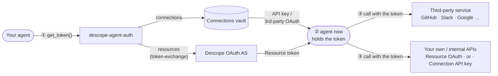
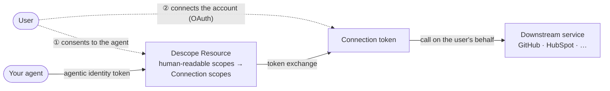
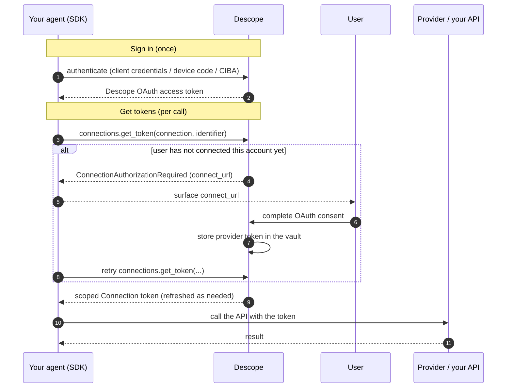

# Descope Agent Auth SDK

A client-side SDK (Python and TypeScript) that does two things for a custom agent:

1. **Signs your agent in** to Descope and gets a Descope token.
2. **Gets the tokens** it needs — **Connection** or **Resource** tokens from the Descope vault — when the agent needs to access an API or MCP server.

It's the identity layer under your agent's tool calls, not a tool catalog. Tool code, API
wrappers, and connector catalogs are out of scope.

## What it looks like

```python
from descope_agent_auth import AgentAuthClient, AccessTokenProvider
from descope_agent_auth.errors import ConnectionAuthorizationRequired

client = AgentAuthClient(project_id="P2...", credential=AccessTokenProvider(access_token=user_jwt))

try:
    github = client.connections.get_token(connection="github", identifier="user@example.com")
    use(github.access_token)              # a fresh, scoped GitHub token
except ConnectionAuthorizationRequired as e:
    redirect_user_to(e.connect_url)       # the user hasn't linked GitHub yet
```

Runnable [examples](examples/) (Python + TypeScript) and a full [quickstart](docs/quickstart.md).

## Who this is for

- ✅ **Custom agents you write yourself**, in any framework (LangChain, LangGraph,
  Google ADK, OpenAI, Vercel AI, Mastra, LlamaIndex, Cloudflare Agents, CrewAI, the
  Anthropic SDK, …). It fetches the tokens the **tools you implement** need — most often
  for the **SaaS APIs those tools call** — from Descope, which stores and refreshes them
  securely so your code doesn't have to. Descope can also manage the agent's connections
  to **remote MCP servers** via the
  [MCP auth adapter](docs/FRAMEWORKS.md#connecting-to-a-remote-mcp-server), storing the
  server's access and refresh tokens for you — but only when you wire the agent yourself,
  not when you connect through a managed MCP client service (AWS Bedrock AgentCore, Azure
  AI Foundry).
- ❌ **Not for building MCP servers.** Protecting a server (DCR, token validation,
  `tools/list` filtering) is the *resource-server* side; this SDK is the *client* side.

<details>
<summary><strong>Building an MCP <em>server</em>?</strong></summary>

Use Descope's MCP server SDKs — [`@descope/mcp-express`](https://docs.descope.com/mcp/mcp-express-sdk)
or the [`descope-mcp` Python SDK](https://docs.descope.com/mcp/python-sdk). They're
complementary: inside a server's tool handler, use **this** SDK to fetch the downstream
token the tool needs.

</details>


## What kind of token does your agent need?

Two kinds of token, two entry points — matching two Descope concepts:
[Connections](https://docs.descope.com/agentic-identity-hub/core-components/connections)
and [Resources](https://docs.descope.com/identity-federation/resources).

### 1. Connection token — `client.connections.get_token(...)`

A credential in the Descope **Connections vault** — either:

- an **API key** for a third-party or internal API, held at the **tenant** level
  (org-wide) or **user + tenant** level (per-user); or
- a **third-party OAuth token** (GitHub, Slack, Google, …), scoped to the agent.

Pass the `identifier` (the user the agent acts for) and an optional `tenant_id`; the
vault returns the right token, refreshed. If the user hasn't connected yet, you get
`ConnectionAuthorizationRequired` carrying a connect URL.

### 2. Resource token — `client.resources.get_token(...)`

An OAuth token for an API *you* build and protect with **Descope as the authorization
server**, minted on demand via token-exchange (no prior authorization step). What you
sign in with sets the scope:

- a **user's** Descope token → scoped to that user;
- the agent's **client-credentials** token → scoped to the agent (M2M).

`resource` is the RFC 8707 indicator; pass `scopes` and, when needed, `audience`.

| Your agent needs to… | Method | Token |
| --- | --- | --- |
| call a third-party or internal API with a stored key | `connections.get_token` | API key |
| call a third-party OAuth provider | `connections.get_token` | provider OAuth token |
| call your own API with Descope OAuth scopes | `resources.get_token` | Resource token |

The flow is **ask → receive → call**:



## How a Connection credential gets into the vault

A Connection token has to exist before the agent can fetch it. Two ways:

- **User connect (runtime).** When `connections.get_token` raises
  `ConnectionAuthorizationRequired`, send the user to the connect URL — your own UI or
  Descope's **Outbound Apps widget**. They complete OAuth consent, Descope stores the
  token, and the next call succeeds. Backend jobs with no browser take a different
  route — see
  [connecting from a backend](docs/quickstart.md#how-a-user-connects-when-the-agent-is-a-backend-process).
- **Management API (admin time).** Your backend or IaC writes an API key
  programmatically.

Resource tokens need no provisioning — they're minted on demand via token-exchange.

## Letting an agent act for a user

Two ways to have an agent act on a user's behalf. Both are valid; they differ in how
the user consents.

### Recommended — model consent with a Resource

Define a Descope **Resource** whose scopes are **human-readable** ("Read your
repositories", "Create HubSpot contacts") and map to the underlying **Connection**
scopes (GitHub `repo`, HubSpot `crm.objects.contacts.write`, …). The user consents to
the *agent* at this layer and it receives an **agentic identity token**; that token is
then exchanged for the downstream **Connection token**, with the consented Resource
scopes mapped to the provider's scopes.

The Resource sits between the agent and the downstream service, so the user gives
**informed consent** — approving what the agent may do in your terms, not raw provider
scopes:



The trade-off: **two consents** per user —

1. **Agent consent** — the user authorizes the agent (the Resource / agentic identity
   token).
2. **Connect** — the provider's own OAuth consent, so the vault holds a downstream
   token the agent can act with. Without it there's no Connection token to exchange for.

### Simpler — reuse an existing user login

If you already authenticate your users — say a support app with a **user JWT from the
browser** — feed that JWT into your backend agent and exchange it for a Connection
token. One consent (the connect); per-user access is governed by the **Connection's
policy**.

```python
# The user JWT you already hold from your app's login:
client = AgentAuthClient(project_id="P2...", credential=AccessTokenProvider(access_token=user_jwt))
gh = client.connections.get_token(connection="github", identifier=user_id)
```

See [Autonomous vs. acting for a user](#autonomous-vs-acting-for-a-user) for the full
mechanics of both.

## How your agent signs in

Pick how the agent authenticates to Descope, configured once at init:

- **OAuth Client ID + Secret** (common) — the agent is a first-class identity in your
  **Agent Directory**, via whichever grant fits:
  - `ClientCredentialsProvider` — autonomous, no user
  - `DeviceCodeProvider` — headless / CLI
  - `CibaProvider` — out-of-band user approval
  - `JwtBearerProvider` — exchange a signed JWT from a trusted issuer (RFC 7523)
- **A user's access token** (`AccessTokenProvider`) — if your app already logged the
  user in, hand that token over for **user-scoped** access.
- **Management Key** (`ManagementKeyProvider`) — static, high-privilege, **bypasses
  Policies**; not recommended, and requires explicit opt-in.

A backend job usually can't do an interactive browser login itself — that happens in
your front-end, which hands the resulting user token to the SDK.

| Where the agent runs | Use |
| --- | --- |
| Backend, no user (acts **as itself** — Resource tokens, tenant Connections) | `ClientCredentialsProvider` |
| Backend, reading a **user's** Connection token | `AccessTokenProvider` or `ManagementKeyProvider` (client credentials **can't** read user tokens) |
| Backend, a specific user **out of band** | `CibaProvider` (push approval) |
| Backend with a signed JWT from a trusted issuer | `JwtBearerProvider` (RFC 7523) |
| CLI / headless dev tool | `DeviceCodeProvider` |

Then fetch tokens at runtime: **Policies** govern what an OAuth agent token can obtain
(a Management Key is unrestricted); Resource tokens are minted via token-exchange and
need an OAuth identity, not a Management Key. Set up sign-in once and ask for a token
whenever — you get a currently-valid one. The SDK refreshes a backend-held user grant
(CIBA, or a handed-off token with a refresh token) without re-prompting; Descope
refreshes the downstream provider tokens for you. See
[token storage & refresh](docs/quickstart.md#token-storage--refresh).

## Autonomous vs. acting for a user

**Autonomous (acts as itself).** With client credentials the agent mints **Resource
tokens** (scoped to itself) and reads **tenant-level** Connection tokens for a tenant
it belongs to. It **cannot** read a *user's* Connection token:

```python
client = AgentAuthClient(
    project_id="P2...",
    credential=ClientCredentialsProvider(client_id="...", client_secret="..."),
)
res = client.resources.get_token(resource="urn:my-api", scopes=["read"])         # agent-scoped
slack = client.connections.get_tenant_token(connection="slack", tenant_id="acme")  # org-shared
```

**Acting for a user.** To read a user's Connection token — or mint a user-scoped
Resource token — supply that user's access token (from your app's login, device code,
or CIBA), or use a management key:

```python
from descope_agent_auth import AccessTokenProvider

# Bind the client to the user's token:
client = AgentAuthClient(project_id="P2...", credential=AccessTokenProvider(access_token=user_jwt))
gh  = client.connections.get_token(connection="github", identifier=user_id)
res = client.resources.get_token(resource="urn:my-api", scopes=["read"])

# Or pass the user token per call on a shared client:
gh  = client.connections.get_token(connection="github", identifier=user_id, act_as_user_token=user_jwt)
```

```ts
import { AccessTokenProvider } from '@descope/agent-auth';

const client = new AgentAuthClient({ projectId: 'P2...', credential: new AccessTokenProvider({ accessToken: userJwt }) });
await client.connections.getToken({ connection: 'github', identifier: userId });

// or per call on a shared client:
await client.connections.getToken({ connection: 'github', identifier: userId, actAsUserToken: userJwt });
```

**Management key (trusted backend, no user token).** Reads **any** user's token by
`identifier` (and `tenant_id` for a tenant-bound one). It **bypasses Policies** — guard
this path — and can only *read* tokens, not perform a user's initial OAuth consent:

```python
from descope_agent_auth import ManagementKeyProvider

client = AgentAuthClient(
    project_id="P2...",
    credential=ManagementKeyProvider(management_key="K...", allow_management_key=True),
)
gh = client.connections.get_token(connection="github", identifier=user_id, tenant_id="acme")
```

## End-to-end at runtime



A sensitive step can require a fresh CIBA **approval** before the token is returned —
see the [quickstart](docs/quickstart.md).

## Packages

| Package | Path | Install |
| --- | --- | --- |
| Python | [`python/`](python/) | `pip install descope-agent-auth` |
| TypeScript | [`typescript/`](typescript/) | `npm install @descope/agent-auth` |

The two surfaces are kept identical, so the mental model transfers. See each package's
README for a copy-pasteable quickstart.

## What's included

Both languages, identical surfaces:

- All sign-in providers: client credentials, device code, CIBA, JWT bearer, management
  key, and bring-your-own access token.
- Connection and Resource token exchange, with the `ConnectionAuthorizationRequired`
  re-auth signal. User, user+tenant, and tenant-level (`get_tenant_token`) Connection
  tokens.
- `get_connect_url` / `getConnectUrl` to build the connect URL, and
  `wait_for_connection` / `waitForConnection` to poll until the user finishes.
- A pluggable token store that persists and refreshes credentials across restarts.
- A human-in-the-loop CIBA **approval gate** on sensitive calls.
- The `with_connection` / `withConnection` tool wrapper, plus a LangGraph
  `interrupt()` helper.
- An **MCP auth adapter** for remote MCP server connections —
  `descopeMcpConnectionAuthProvider` / `descopeMcpResourceAuthProvider` (TS) and
  `connection_auth` / `resource_auth` (Python). See the
  [framework cookbook](docs/FRAMEWORKS.md#connecting-to-a-remote-mcp-server).

[Quickstart](docs/quickstart.md) · [SDK reference](docs/api-reference.md) ·
[examples](examples/) · [framework cookbook](docs/FRAMEWORKS.md).

## Development

A release-please monorepo using Conventional Commits.

```bash
# Python
cd python && pip install -e ".[dev]" && pytest -q && ruff check descope_agent_auth

# TypeScript
cd typescript && npm ci && npm test && npm run lint && npm run build
```

## License

[MIT](LICENSE)
