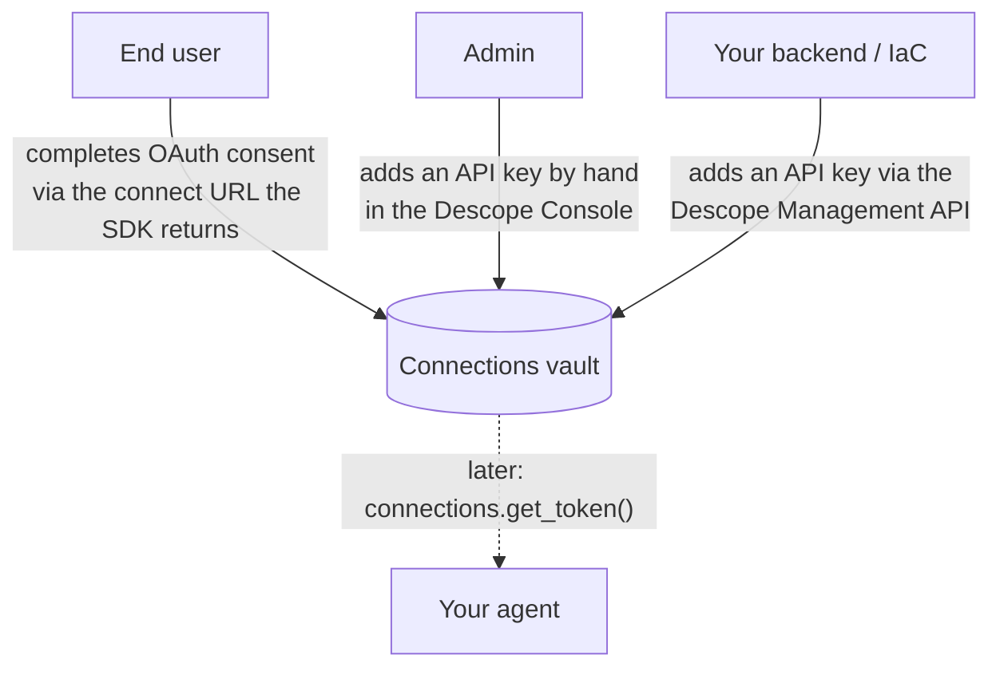
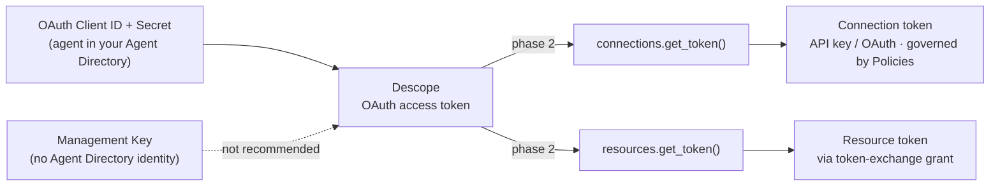
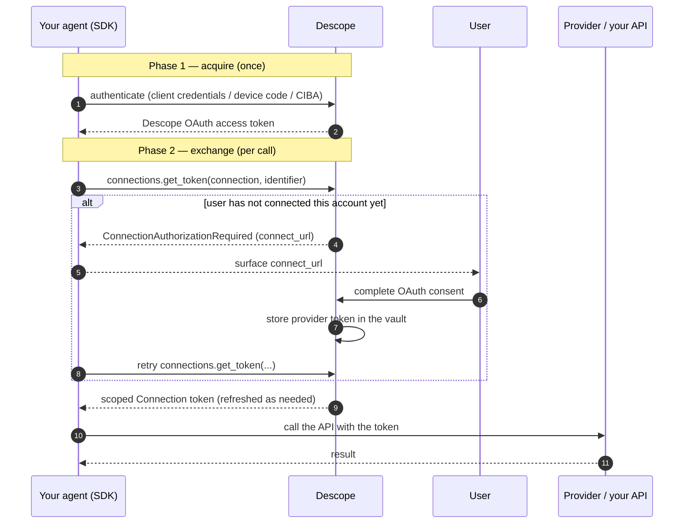

# Descope Agent Auth SDK

A client-side SDK (Python and TypeScript) that makes it easy to wire a custom
agent to Descope. It does two things and only two things:

1. **Acquire** a Descope credential for the agent.
2. **Exchange** that credential for **Connection tokens** or **Resource tokens** from the Descope vault.

Everything else — tool code, API wrappers, a connector catalog — is out of scope
by design. This is the auth substrate an agent's tool calls sit on top of, not a
runtime tool catalog.

## What it looks like

```python
from descope_agent_auth import AgentAuthClient, AccessTokenProvider
from descope_agent_auth.errors import ConnectionAuthorizationRequired

client = AgentAuthClient(project_id="P2...", credential=AccessTokenProvider(access_token=user_jwt))

try:
    github = client.connections.get_token(connection="github", identifier="user@example.com")
    use(github.access_token)              # a fresh, scoped GitHub token
except ConnectionAuthorizationRequired as e:
    redirect_user_to(e.connect_url)       # the user hasn't linked GitHub yet
```

Runnable samples (Python + TypeScript) in **[`examples/`](examples/)**. Full
walkthrough: **[standalone Connections quickstart](docs/standalone-connections.md)**.

## Who this is for

- ✅ **Homegrown / custom-built agents** — agents you write yourself, in any
  framework (LangChain, LangGraph, Google ADK, OpenAI, Vercel AI, Mastra,
  LlamaIndex, Cloudflare Agents, AG2/AutoGen, CrewAI, TanStack AI, the Anthropic
  SDK, and more). It manages the tokens the **tools you implement** need to call
  downstream APIs — putting your agent on the **OAuth client** side.
- ❌ **Not** for building MCP servers. Protecting an MCP server (DCR, metadata
  endpoints, token validation, `tools/list` filtering) is a different job — the
  *resource-server* side. This SDK is the *client* side: it acquires and uses tokens.

> **Scope in one line:** this SDK manages the tokens **the tools you implement**
> need — not your agent's OAuth connection to a third-party MCP server. Use it
> *inside* your tool code.

<details>
<summary><strong>Using your agent as an MCP client to third-party servers?</strong></summary>

If your agent connects to remote MCP servers as a *client* — calling tools those
servers expose rather than tools you wrote — this SDK is not the right layer. The
OAuth between the agent and those servers is handled by your MCP client stack, and
you're usually not implementing those tools yourself.

**This SDK belongs in tool code you implement** — a custom function, a Lambda action
group, a framework-native tool — to fetch downstream API tokens for APIs your agent
calls directly. It is not a replacement for the auth your MCP client uses to reach
third-party MCP servers.

</details>

<details>
<summary><strong>Building an MCP <em>server</em>?</strong></summary>

Use Descope's MCP server SDKs — [`@descope/mcp-express`](https://docs.descope.com/mcp/mcp-express-sdk)
(Node/Express) or the [`descope-mcp` Python SDK](https://docs.descope.com/mcp/python-sdk)
([overview](https://docs.descope.com/mcp)). They're complementary: when one of your
server's tools needs a downstream API token, its handler can use **this** SDK —
resolve the user from the validated request, then call `connections.get_token` /
`resources.get_token`.

</details>

**One core SDK, not one per framework.** Every framework defines a tool as a
function; the `with_connection` / `withConnection` wrapper drops a fresh, scoped
token into that function — so there's nothing to install per framework. It runs on
Node, Cloudflare Workers, Deno, Bun, and browsers. See the
**[framework cookbook](docs/FRAMEWORKS.md)** for a copy-paste snippet per framework.

## What kind of token does your agent need?

To call any service, your agent ultimately needs one of **two kinds of token**.
The SDK fetches both, through two entry points.

### 1. A Connection token — `client.connections.get_token(...)`

A **Connection** is a credential stored in the Descope **Connections vault**. It is
either:

- an **API key** — a stored secret for a service. The service can be a
  **third-party API _or_ one of your own internal APIs** — handy when you'd rather
  not put an existing API behind Descope OAuth scopes just to let an agent call it.
  Held at either:
  - the **tenant level** (one key for your whole organization), or
  - the **user + tenant level** (a per-user key the agent uses on that user's
    behalf); or
- a **third-party OAuth token** — for an OAuth provider set up from Descope's
  **Connection template library** or a custom Connection (GitHub, Slack, Google,
  …), scoped to the agent's identity.

You pass the `identifier` (the user/principal the agent acts for) and optionally a
`tenant_id`; the vault returns the right stored token, refreshed as needed. If the
user hasn't connected the account yet, you get `ConnectionAuthorizationRequired`
carrying a connect URL.

### 2. A Resource token — `client.resources.get_token(...)`

A **Resource** is an API *you* build and protect with **Descope as the OAuth
authorization server**. The SDK obtains a Descope-issued OAuth token scoped to that
Resource using the **OAuth token-exchange grant**
(`urn:ietf:params:oauth:grant-type:token-exchange`) — exchanging a Descope token for
a Resource-scoped one. **What you exchange determines the scope:**

- a **user's** Descope token (`act_as_user_token` / `AccessTokenProvider`) → a Resource
  token **scoped to that user**;
- the agent's **client-credentials** token → a Resource token **scoped to the client
  (M2M) identity**, not a user.

Unlike Connection tokens, a Resource token needs **no prior authorization step** —
it's minted on demand from whichever identity you present. `resource` is the RFC 8707
resource indicator; pass `scopes` and, when the provider needs it, `audience`.

| Your agent needs to… | Method | Token you get | Source |
| --- | --- | --- | --- |
| call a **third-party or internal** API with a stored key | `connections.get_token` | API key | Connections vault (tenant, or user + tenant) |
| call a third-party OAuth provider | `connections.get_token` | provider OAuth token | Connections vault (template or custom) |
| call your own API with **Descope-issued OAuth scopes** | `resources.get_token` | Resource token (Descope OAuth) | token-exchange grant |

> Two ways to reach **your own** APIs: use a **Resource token** when you want
> Descope to mint OAuth tokens with scopes for it, or a Connection **API key** when
> you'd rather keep an existing internal API as-is.

The flow reads left to right — **ask → receive → call**. (The agent in ① and ② is
the same agent: it asks, gets the token back, then makes the call in ③.)


In the default `fetch` mode, the token is returned to the agent and it makes the
call itself.

## How a credential gets into Descope

Before the agent can fetch a **Connection** token, that credential has to exist in
the Connections vault. There are three ways it gets there — the first is runtime
(driven by the SDK), the other two are design/admin time:



- **User connect (via the SDK).** When you call `connections.get_token` and the
  user hasn't connected yet, the SDK raises `ConnectionAuthorizationRequired` with
  a **connect URL**. Send the user there — via your own UI or Descope's hosted
  **Outbound Apps widget** — and they complete the provider's OAuth consent; Descope
  stores the resulting token in the vault. The next `get_token` call succeeds. (This
  is the OAuth path — GitHub, Slack, Google, ….) A pure backend job (no browser, no
  user present) takes a slightly different route — see [How a user connects when the agent is a backend process](docs/standalone-connections.md#how-a-user-connects-when-the-agent-is-a-backend-process).
- **Console.** An admin pastes an API key into a Connection in the Descope Console
  (typical for a static third-party API key, at the tenant or user level).
- **Management API.** Your backend or infrastructure-as-code writes the API key
  programmatically.

Resource tokens need no provisioning step — they're minted on demand from your
agent's identity via token-exchange.

## How a credential gets into Descope

Before the agent can fetch a **Connection** token, that credential has to exist in
the Connections vault. There are three ways it gets there — the first is runtime
(driven by the SDK), the other two are design/admin time:


- **User connect (via the SDK).** When you call `connections.get_token` and the
  user hasn't connected yet, the SDK raises `ConnectionAuthorizationRequired` with
  a **connect URL**. Send the user there; they complete the provider's OAuth
  consent; Descope stores the resulting token in the vault. The next
  `get_token` call succeeds. (This is the OAuth path — GitHub, Slack, Google, ….)
- **Console.** An admin pastes an API key into a Connection in the Descope Console
  (typical for a static third-party API key, at the tenant or user level).
- **Management API.** Your backend or infrastructure-as-code writes the API key
  programmatically.

Resource tokens need no provisioning step — they're minted on demand from your
agent's identity via token-exchange.

## How the SDK gets those tokens

It starts with **how your agent authenticates to Descope** (phase 1), configured
once at init — and you have three options:

- **OAuth Client ID + Client Secret** (the common case) — your agent is a
  first-class identity in your **Agent Directory**. The SDK gets a Descope OAuth
  access token using whichever **grant** fits:
  - `ClientCredentialsProvider` — autonomous agent, no user
  - `DeviceCodeProvider` — headless agent (device code)
  - `CibaProvider` — out-of-band user approval (CIBA)
  - `JwtBearerProvider` — exchange a signed JWT from a trusted issuer (RFC 7523)
- **A user's access token you already hold** (`AccessTokenProvider`) — if your app
  already logged the user in with Descope, hand that token to the agent directly
  (no re-authentication) for **user-scoped** access.
- **Management Key** (`ManagementKeyProvider`) — use this only if you *don't* want
  the agent represented as a unique Agent in your Agent Directory. It's a static,
  high-privilege credential that **bypasses Policies**, so it is not the
  recommended path (requires explicit opt-in).

Which one depends on **where the agent runs** — and a backend job/service usually
can't do an interactive browser login itself (that happens in your front-end app,
which then hands the resulting user token to the SDK):

| Where the agent runs | Use |
| --- | --- |
| Backend, no user (agent acts **as itself** — Resource tokens, tenant-level Connections) | `ClientCredentialsProvider` |
| Backend, reading a **user's** Connection token | `AccessTokenProvider` (user's token handed from your app) or `ManagementKeyProvider` — a client-credentials token **cannot** read user tokens; see below |
| Backend, needs a specific user **out of band** | `CibaProvider` (push approval, yields a user token) |
| CLI / headless dev tool | `DeviceCodeProvider` |

Then, at runtime (phase 2), the SDK **exchanges** that phase-1 credential for the
token the agent actually needs:



- A **Connection token** is pulled from the vault. When the phase-1 credential is
  an agent OAuth token, **Policies** govern what it may obtain; a
  Management Key is unrestricted.
- A **Resource token** is minted via the **token-exchange** grant. (This needs an
  OAuth agent identity — it does not apply to a Management Key.)

Configure phase 1 once; call phase 2 repeatedly — you ask for a token and get a
currently-valid one. Refresh/persistence matters most for a **user grant the backend
holds across runs** (`CIBA`, or a handed-off user token that carries a refresh
token): the SDK refreshes it without re-prompting the user. `ClientCredentials`
simply re-acquires. Either way, Descope refreshes the **downstream** provider tokens
in the vault for you. See
[token storage & refresh](docs/standalone-connections.md#token-storage--refresh).

## Autonomous vs. acting for a user

**Autonomous agent (acts as itself).** With client credentials the agent is its own
identity. It can mint **Resource tokens** (token-exchange, scoped to the agent
itself) and read **tenant-level** Connection tokens for a tenant it belongs to. It
**cannot** read a *user's* Connection token — those aren't keyed to the agent:

```python
client = AgentAuthClient(
    project_id="P2...",
    credential=ClientCredentialsProvider(client_id="...", client_secret="..."),
)
# A Resource token for the agent's own identity (Descope-issued OAuth scopes):
res = client.resources.get_token(resource="urn:my-api", scopes=["read"])
# Or a tenant-level Connection token (org-shared, no user) for a tenant it belongs to:
slack = client.connections.get_tenant_token(connection="slack", tenant_id="acme")
```

> **A backend job can't read a *user's* Connection token from client credentials
> alone.** There is no "agent + user id reads any user" path — `connections.get_token`
> for a user-level token needs the **user's** Descope access token or a **management
> key**. So your front-end (or a CIBA/device flow) gets the user's token, and the
> backend presents it via `AccessTokenProvider` / `act_as_user_token`, as below.

**Acting for a user (the agent wields the user's own Descope token).** To read a
user's Connection token — and especially to mint a **user-scoped Resource token**
(the user's token becomes the token-exchange `subject_token`) — supply that user's
access token (the one you got from your app's login, device code, or CIBA), or use
a management key. Two ways with a user token:

```python
# A) You already hold the user's token (e.g. from your app's login):
from descope_agent_auth import AccessTokenProvider

client = AgentAuthClient(project_id="P2...", credential=AccessTokenProvider(access_token=user_jwt))
gh  = client.connections.get_token(connection="github", identifier=user_id)   # user-scoped
res = client.resources.get_token(resource="urn:my-api", scopes=["read"])      # user-scoped (subject = user_jwt)

# B) One shared client, many users — pass the user token per call:
gh  = client.connections.get_token(connection="github", identifier=user_id, act_as_user_token=user_jwt)
res = client.resources.get_token(resource="urn:my-api", act_as_user_token=user_jwt)
```

```ts
// TypeScript — same two options
import { AccessTokenProvider } from '@descope/agent-auth';

const client = new AgentAuthClient({ projectId: 'P2...', credential: new AccessTokenProvider({ accessToken: userJwt }) });
await client.connections.getToken({ connection: 'github', identifier: userId });

// or per call on a shared client:
await client.connections.getToken({ connection: 'github', identifier: userId, actAsUserToken: userJwt });
await client.resources.getToken({ resource: 'urn:my-api', actAsUserToken: userJwt });
```

> Where does `user_jwt` come from? Your app authenticates the user with Descope (its
> own login, device code, or CIBA) and gets their access token; you hand that token
> to the SDK. The `DeviceCodeProvider` / `CibaProvider` can also acquire it for you —
> their resulting credential is the user's token and flows into phase 2 the same way.

**Management key (trusted backend, no user token).** A common server-side shape: the
agent has no user token but needs a specific user's already-connected token. A
management key fetches **any** user's token by `identifier` (and `tenant_id` for a
tenant-bound one). It **bypasses Policies** — guard this path — and it can only
*read* tokens, not perform a user's initial OAuth consent (that's still interactive).

```python
from descope_agent_auth import ManagementKeyProvider

client = AgentAuthClient(
    project_id="P2...",
    credential=ManagementKeyProvider(management_key="K...", allow_management_key=True),
)
gh = client.connections.get_token(connection="github", identifier=user_id)              # any user
gh = client.connections.get_token(connection="github", identifier=user_id, tenant_id="acme")  # + tenant
```

## End-to-end at runtime



For a sensitive step you can also require a fresh CIBA **approval** before the
exchange — see [docs/standalone-connections.md](docs/standalone-connections.md).

## Packages

| Package | Path | Install |
| --- | --- | --- |
| Python | [`python/`](python/) | `pip install descope-agent-auth` |
| TypeScript | [`typescript/`](typescript/) | `npm install @descope/agent-auth` |

The surfaces are kept identical across both languages so the docs and mental model
transfer. See each package's README for a copy-pasteable quickstart.

## What's included

Both languages, identical surfaces:

- **Python is async-first** — use `AsyncAgentAuthClient` (and `with_connection_async`)
  in async apps; `AgentAuthClient` is a synchronous facade with the same API. TypeScript
  is async-native.
- All credential providers: client credentials, device code, CIBA, JWT bearer
  (RFC 7523), management key, and bring-your-own access token.
- Connection and Resource token exchange, with the
  `ConnectionAuthorizationRequired` re-auth signal and the agent-token-vs-management-key
  distinction. User-level, user+tenant, and tenant-level (`get_tenant_token`)
  Connection tokens.
- `get_connect_url` / `getConnectUrl` — generate the "Connect <provider>" URL to
  send a user through, and `wait_for_connection` / `waitForConnection` to poll until
  they finish.
- A pluggable token store that persists and refreshes credentials (including
  refresh tokens) across restarts.
- A human-in-the-loop CIBA **approval gate** on sensitive calls.
- The `with_connection` / `withConnection` tool wrapper, plus a LangGraph
  `interrupt()` helper.

`mode: "execute"` (routing calls through Descope so the token never enters the
agent process) is reserved — the client accepts it today and turns it on when
Descope's hosted execution endpoint becomes available.

Quickstart: [standalone Connections](docs/standalone-connections.md). Runnable
[examples](examples/) (Python + TypeScript). Per-framework snippets:
[framework cookbook](docs/FRAMEWORKS.md).

## Development

This is a release-please monorepo using Conventional Commits.

```bash
# Python
cd python && pip install -e ".[dev]" && pytest -q && ruff check descope_agent_auth

# TypeScript
cd typescript && npm ci && npm test && npm run lint && npm run build
```

## License

[MIT](LICENSE)
