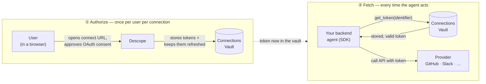
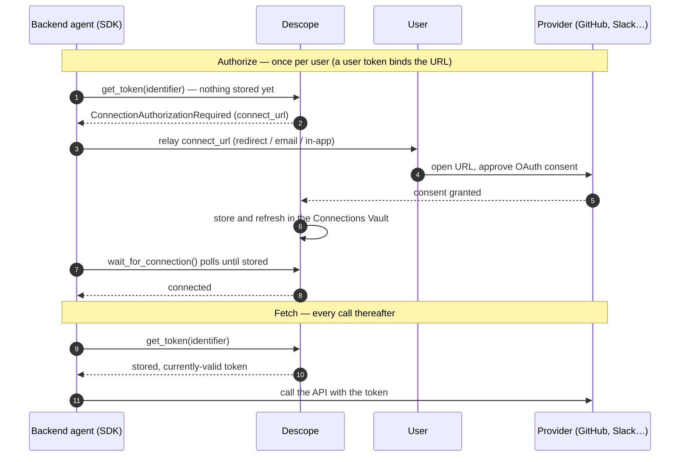

# Quickstart

Your agent signs in to Descope once, then trades that for the provider tokens
(GitHub, Slack, Google, …) its tools need. Tokens come from the Descope vault,
already scoped and refreshed.

> Building an MCP server? Use this SDK inside your tool handlers to fetch downstream
> tokens. To *protect* the server itself, use Descope's
> [MCP server SDKs](https://docs.descope.com/mcp) — this SDK is the client side.

## How it works

1. **Sign in** — configure how the agent authenticates to Descope, once at init.
2. **Get tokens** — call `get_token` at runtime whenever you need one.

Both the agent's credential and the downstream tokens refresh underneath; you always
get a currently-valid token.

## Authorize once, fetch every time

A Connection has two distinct operations:

1. **Authorize a user** (once per user per connection) — send them a connect URL, they
   complete OAuth consent, and Descope stores and refreshes their tokens in the vault.
   You never handle the callback or store tokens.
2. **Fetch the token** (every time the agent acts) — `get_token` returns the stored,
   valid token. No user, no browser.



You get the connect URL two ways:

- **Proactively** — `get_connect_url` / `getConnectUrl` (e.g. behind a "Connect GitHub"
  button).
- **Just in time** — `get_token` raises `ConnectionAuthorizationRequired` carrying the
  URL when the user isn't connected.

Once the user consents, the next `get_token` works. `wait_for_connection` optionally
polls until the token lands. For backend agents with no browser, see
[below](#how-a-user-connects-when-the-agent-is-a-backend-process).

## Prerequisites

- A Descope project with an **Outbound App / Connection** configured for your provider
  (e.g. `github`), set up in the Descope Console or via the Descope MCP server. Default
  scopes live on the Connection.
- A way for the agent to authenticate to Descope (see the provider table below).

---

## Python

```bash
pip install descope-agent-auth
```

```python
from descope_agent_auth import AgentAuthClient, AccessTokenProvider
from descope_agent_auth.errors import ConnectionAuthorizationRequired

# A user-level Connection token needs that user's Descope token (or a management key);
# see "Choosing how the agent signs in" below.
client = AgentAuthClient(
    project_id="P2abc...",
    credential=AccessTokenProvider(access_token=user_jwt),   # the user's Descope token
)

try:
    github = client.connections.get_token(
        connection="github",
        identifier="user@example.com",   # the user whose token you're fetching
        # scopes=["repo"],               # optional; overrides the Connection defaults
    )
    use_github(github.access_token)       # a downstream GitHub token, refreshed as needed
except ConnectionAuthorizationRequired as e:
    # Not connected yet — send the user to e.connect_url to consent, then retry.
    redirect_user_to(e.connect_url)
```

### Tool wrapper

```python
from descope_agent_auth import with_connection

@with_connection(client, connection="github", scopes=["repo"])
def list_repos(token, identifier):
    gh = GitHub(auth=token)            # token injected, already scoped + fresh
    return [r.name for r in gh.repos.list_for_authenticated_user()]

repos = list_repos(identifier="user@example.com")
# ConnectionAuthorizationRequired propagates if the user must connect first.
```

### Async

In an async app (FastAPI, LangGraph, …) use `AsyncAgentAuthClient` — same API,
awaited. `with_connection_async` is the awaitable wrapper.

```python
from descope_agent_auth import AsyncAgentAuthClient, AccessTokenProvider

async with AsyncAgentAuthClient(
    project_id="P2...",
    credential=AccessTokenProvider(access_token=user_jwt),
) as client:
    github = await client.connections.get_token(connection="github", identifier=user_id)
```

---

## TypeScript

```bash
npm install @descope/agent-auth
```

```ts
import {
  AgentAuthClient,
  AccessTokenProvider,
  ConnectionAuthorizationRequired,
} from '@descope/agent-auth';

const client = new AgentAuthClient({
  projectId: 'P2abc...',
  credential: new AccessTokenProvider({ accessToken: userJwt }), // the user's Descope token
});

try {
  const github = await client.connections.getToken({
    connection: 'github',
    identifier: 'user@example.com',
    // scopes: ['repo'],   // optional; overrides the Connection defaults
  });
  useGithub(github.accessToken);
} catch (e) {
  if (e instanceof ConnectionAuthorizationRequired) {
    redirectUserTo(e.connectUrl);
  } else {
    throw e;
  }
}
```

### Tool wrapper

```ts
import { withConnection } from '@descope/agent-auth';

const listRepos = withConnection(
  client,
  { connection: 'github', scopes: ['repo'] },
  async (token, identifier) => {
    const octokit = new Octokit({ auth: token });
    const { data } = await octokit.rest.repos.listForAuthenticatedUser();
    return data.map((r) => r.name);
  },
);

const repos = await listRepos('user@example.com');
```

---

## Choosing how the agent signs in

| Provider | Use when |
| --- | --- |
| `ClientCredentialsProvider` | autonomous agent, no user in the loop |
| `DeviceCodeProvider` | headless agent (no browser); shows a verification URL + code |
| `CibaProvider` | the agent needs a specific user's approval out of band |
| `AccessTokenProvider` | you already hold a user's Descope access token (user-scoped) |
| `JwtBearerProvider` | you hold a signed JWT from a trusted issuer (RFC 7523 — e.g. a cloud workload-identity token) |
| `ManagementKeyProvider` | privileged, **not recommended** — bypasses Policies |

> **Signing in ≠ what you can fetch.** A **user-level** Connection token (the common
> case) can only be fetched with that user's access token (`AccessTokenProvider` /
> `act_as_user_token`) or a management key. A client-credentials / M2M token **can't**
> read user tokens — only **tenant-level** Connection tokens (`get_tenant_token`) and
> **Resource** tokens (scoped to the M2M client itself).

### User-scoped access

To act as a specific user — and to mint user-scoped Resource tokens — present that
user's Descope access token. Configure the client with `AccessTokenProvider`, or pass
`act_as_user_token` / `actAsUserToken` per call on a shared client:

```python
from descope_agent_auth import AccessTokenProvider

# A — client bound to the user's token:
client = AgentAuthClient(project_id="P2...", credential=AccessTokenProvider(access_token=user_jwt))
gh = client.connections.get_token(connection="github", identifier=user_id)

# B — one shared client, user token per call:
gh = client.connections.get_token(connection="github", identifier=user_id, act_as_user_token=user_jwt)
res = client.resources.get_token(resource="urn:my-api", act_as_user_token=user_jwt)
```

```ts
import { AccessTokenProvider } from '@descope/agent-auth';

const client = new AgentAuthClient({ projectId: 'P2...', credential: new AccessTokenProvider({ accessToken: userJwt }) });
await client.connections.getToken({ connection: 'github', identifier: userId });

// or per call on a shared client:
await client.connections.getToken({ connection: 'github', identifier: userId, actAsUserToken: userJwt });
```

### Management key (trusted backend, no user token)

For an agent that runs server-side with no user token but needs a specific user's
already-connected token. A management key fetches **any** user's token by `identifier`
(and `tenant_id` for a tenant-bound one). It **bypasses Policies** — guard who can
invoke it.

```python
from descope_agent_auth import AgentAuthClient, ManagementKeyProvider

client = AgentAuthClient(
    project_id="P2...",
    credential=ManagementKeyProvider(management_key="K...", allow_management_key=True),
)
gh = client.connections.get_token(connection="github", identifier=user_id)                     # any user
gh = client.connections.get_token(connection="github", identifier=user_id, tenant_id="acme")   # + tenant
slack = client.connections.get_tenant_token(connection="slack", tenant_id="acme")              # org-shared
```

```ts
import { AgentAuthClient, ManagementKeyProvider } from '@descope/agent-auth';

const client = new AgentAuthClient({
  projectId: 'P2...',
  credential: new ManagementKeyProvider({ managementKey: 'K...', allowManagementKey: true }),
});

await client.connections.getToken({ connection: 'github', identifier: userId, tenantId: 'acme' });
await client.connections.getTenantToken({ connection: 'slack', tenantId: 'acme' });
```

> A management key **reads** tokens; it can't perform a user's **initial** OAuth
> consent. The user must connect first through their own session — see
> [How a user connects when the agent is a backend process](#how-a-user-connects-when-the-agent-is-a-backend-process).

## Scopes

- **Omit** `scopes` → the Connection's configured default scopes are used.
- **Pass** `scopes` → they fully override the defaults (not clamped to a subset).

The real guardrail is **Policies** plus downstream provider consent, not the
default-scope list.

### Scopes and the connect URL

The scopes you pass to `with_connection` / `get_token` are used for **both** the token
fetch and the connect URL, so the consent screen requests exactly what the tool needs.
Omit them and the connect URL uses the Connection's default scopes.

```python
@with_connection(client, connection="github", scopes=["repo"])
def list_repos(token, identifier): ...
# If the user must connect first, e.connect_url already requests ["repo"].
```

Because each tool's connect URL requests only its scopes, a user may be prompted more
than once as tools need new scopes (incremental consent). For a single up-front
consent, set the Connection's default scopes to the superset. Pass `redirect_url` /
`redirectUrl` to control where the user lands; `connect_options` / `connectOptions` is
an advanced escape hatch (provider-specific OAuth params like `prompt`) most apps never
need.

## Token levels: user, user + tenant, and tenant

| Level | Fetch with | Who can fetch |
| --- | --- | --- |
| **User** | `get_token(identifier=user_id)` | the user's access token, or a management key |
| **User + tenant** | `get_token(identifier=user_id, tenant_id=…)` | the user's access token, or a management key |
| **Tenant** (org-shared, no user) | `get_tenant_token(tenant_id=…)` | an M2M client associated with the tenant, or a management key |

**User vs. user + tenant.** One Connection can hold several tokens for the same user —
one per tenant — and they're **not interchangeable**. Omit `tenant_id` for the
tenant-less token; pass it for the tenant-bound one. Asking for a tenant-bound token
*without* its `tenant_id` reads as "not connected" and raises
`ConnectionAuthorizationRequired`.

**Tenant-level** is the only Connection fetch an autonomous agent (client credentials,
no user token) can do — the token belongs to the tenant, not a user. It's provisioned
via the Management API / IaC, so there's no connect-URL fallback on a miss.

```python
gh = client.connections.get_token(connection="github", identifier=user_id)
gh_acme = client.connections.get_token(connection="github", identifier=user_id, tenant_id="acme")
slack = client.connections.get_tenant_token(connection="slack", tenant_id="acme")
```

```ts
await client.connections.getToken({ connection: 'github', identifier: userId });
await client.connections.getToken({ connection: 'github', identifier: userId, tenantId: 'acme' });
await client.connections.getTenantToken({ connection: 'slack', tenantId: 'acme' });
```

## How a user connects when the agent is a backend process

Front-end is simple: the user is in a browser with a live Descope session, you catch
`ConnectionAuthorizationRequired` and redirect to `connect_url`, they consent, the
retry succeeds.



A backend job has no browser and usually no live user session, so that path doesn't
translate directly. The core constraint:

> **First-time third-party consent (GitHub, Slack, …) needs the user in a browser at
> the connect URL — there's no token-only shortcut.** The consent *is* the thing being
> created. **CIBA doesn't solve it**: CIBA yields a Descope *user* token, not a GitHub
> token; the user still consents to the provider interactively.

So the job is getting the user to the connect URL. Three options:

1. **Defer to the user's next visit (common).** On `ConnectionAuthorizationRequired`,
   flag the identity and surface the connect step next time the user is in your
   front-end — via Descope's **Outbound Apps widget** or a `/connect` route.
2. **Mint the URL from the backend and relay it.** Generate a user-bound connect URL,
   send it (email / in-app / redirect), and poll. Needs a **user token**
   (`act_as_user_token`) — a stored refresh token, or one from CIBA / device-code. A
   bare management key can't.

   ```python
   url = client.connections.get_connect_url(
       connection="github", identifier=user_id, act_as_user_token=user_token,
   )
   send_to_user(url)                          # print / email / in-app
   token = client.connections.wait_for_connection(
       connection="github", identifier=user_id, act_as_user_token=user_token,
   )                                          # polls until the user consents
   ```

3. **Connect inside the login flow (Descope-specific).** Add a connection step as a
   flow action, so the user consents during authentication (including a CIBA flow) —
   no separate connect URL afterward.

In all cases consent is interactive; the backend's job is to get the URL in front of
the user and poll `wait_for_connection`.

### Waiting for the connection to complete

`wait_for_connection` / `waitForConnection` polls until the user consents (or times
out), using the client's configured credential (add `act_as_user_token` on a shared
client).

```python
token = client.connections.wait_for_connection(
    connection="github", identifier=user_id, poll_interval=2.0, timeout=300.0,
)
# Returns once the vault holds the token; AgentAuthError on timeout.
```

```ts
const token = await client.connections.waitForConnection({
  connection: 'github', identifier: userId, pollIntervalSeconds: 2, timeoutSeconds: 300,
});
```

## Common deployment patterns

Which calls you use depends on **whose account the agent acts against**.

### Per-user (each user connects their own account)

The default. Each user authorizes once (interactive — see
[above](#how-a-user-connects-when-the-agent-is-a-backend-process)); then fetch by
`identifier`:

```python
gh = client.connections.get_token(connection="github", identifier=user_id)
```

### Org-shared credentials

One connection every user calls against (a single org Gmail, Salesforce, or GitHub).
Store it **tenant-level** and fetch with `get_tenant_token`; an autonomous agent
(tenant-associated) or a management key can read it:

```python
client = AgentAuthClient(
    project_id="P2...",
    credential=ClientCredentialsProvider(client_id="...", client_secret="..."),
)
gmail = client.connections.get_tenant_token(connection="gmail", tenant_id="acme")
```

### Background agent acting for many users

A service account running work for many users. Use a **management key** and fetch per
user:

```python
client = AgentAuthClient(
    project_id="P2...",
    credential=ManagementKeyProvider(management_key="K...", allow_management_key=True),
)
for user_id in batch:
    gh = client.connections.get_token(connection="github", identifier=user_id)
```

A management key can't mint a user's *initial* connect URL — host a connect UI
(Outbound Apps widget or `/connect`) so each user links once; after that the agent just
fetches.

### Pre-authenticating users

Connect users outside an agent run (onboarding, a settings page, a pre-flight check):
generate the URL, send the user, wait.

```python
url = client.connections.get_connect_url(connection="gmail", identifier=user_id)
send_to_user(url)
client.connections.wait_for_connection(connection="gmail", identifier=user_id)
```

To check several connections up front, loop and collect those still needing a link:

```python
needs_connect = []
for conn in ["gmail", "github"]:
    try:
        client.connections.get_token(connection=conn, identifier=user_id)
    except ConnectionAuthorizationRequired as e:
        needs_connect.append((conn, e.connect_url))
# send each connect URL to the user, then proceed once needs_connect is empty
```

## Human-in-the-loop approval (CIBA gate)

For a sensitive exchange, require a fresh user sign-off on a trusted device before the
token is returned. Configure an `approval` provider on the client, then pass
`require_approval` / `requireApproval` to the call.

```python
from descope_agent_auth import AgentAuthClient, CibaProvider, ApprovalRequest

client = AgentAuthClient(
    project_id="P2abc...",
    credential=ClientCredentialsProvider(client_id="...", client_secret="..."),
    approval=CibaProvider(client_id="...", login_hint="user@example.com"),
)

token = client.connections.get_token(
    connection="github",
    identifier="user@example.com",
    require_approval=ApprovalRequest(
        login_hint="user@example.com",
        binding_message="Approve the agent deleting branch protection",
    ),
)
# Blocks until the user approves on their device, else raises ApprovalDenied / ApprovalTimeout.
```

```ts
const client = new AgentAuthClient({
  projectId: 'P2abc...',
  credential: new ClientCredentialsProvider({ clientId: '...', clientSecret: '...' }),
  approval: new CibaProvider({ clientId: '...', loginHint: 'user@example.com' }),
});

const token = await client.connections.getToken({
  connection: 'github',
  identifier: 'user@example.com',
  requireApproval: {
    loginHint: 'user@example.com',
    bindingMessage: 'Approve the agent deleting branch protection',
  },
});
```

## Errors worth catching

| Error | Meaning |
| --- | --- |
| `ConnectionAuthorizationRequired` | user hasn't connected the account; carries `connect_url` / `connectUrl` |
| `PolicyDenied` | agent token lacks Policy permission |
| `ApprovalDenied` / `ApprovalTimeout` | the CIBA gate was rejected or timed out |
| `CredentialAcquisitionFailed` | the agent couldn't sign in to Descope (bad creds, device-flow timeout, …) |
| `TokenExchangeFailed` | other token-fetch transport/validation failure |

## Token storage & refresh

The `store` holds **both** kinds of token: the agent's own Descope credential
(including its refresh token) and the downstream provider tokens. Everything refreshes
lazily on access.

This matters most for **device code / CIBA**: their tokens persist with the refresh
token, so a restarted or multi-process agent **refreshes instead of re-running the
interactive flow**. `ClientCredentials` simply re-acquires; `ManagementKey` and
bring-your-own `AccessTokenProvider` tokens aren't persisted.

The default `MemoryTokenStore` caches in-process — fine for one long-running process,
lost on restart. For multi-process, serverless, or restart-safe deployments, implement
the `TokenStore` interface (`get`/`set`/`delete`/`list`) over Redis, a database, or a
secrets manager and pass it as `store`.

> **Security:** a persistent store holds **refresh tokens** — treat it as a secret
> store (encryption at rest, access controls). The SDK never logs token values.

### Caching vs. policy enforcement

Descope enforces **Policies at retrieval time** — when the SDK calls the vault. A
cached token therefore **skips the policy check** until it expires: if a Policy is
tightened or access revoked, a cached token keeps working until its TTL lapses.

To re-evaluate Policies (and revocation) on **every** call, turn off caching with
`cache_tokens=False` / `cacheTokens: false`:

```python
client = AgentAuthClient(
    project_id="P2...",
    credential=ClientCredentialsProvider(client_id="...", client_secret="..."),
    cache_tokens=False,   # every fetch re-enforces Policies
)
```

```ts
const client = new AgentAuthClient({
  projectId: 'P2...',
  credential: new ClientCredentialsProvider({ clientId: '...', clientSecret: '...' }),
  cacheTokens: false, // every fetch re-enforces Policies
});
```

This only stops caching the fetched tokens — the agent's own login still persists and
refreshes. For a one-off fresh fetch, pass `force_refresh=True` / `forceRefresh: true`
on the call.
