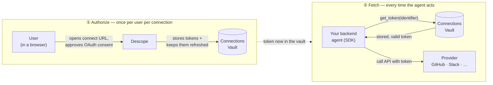
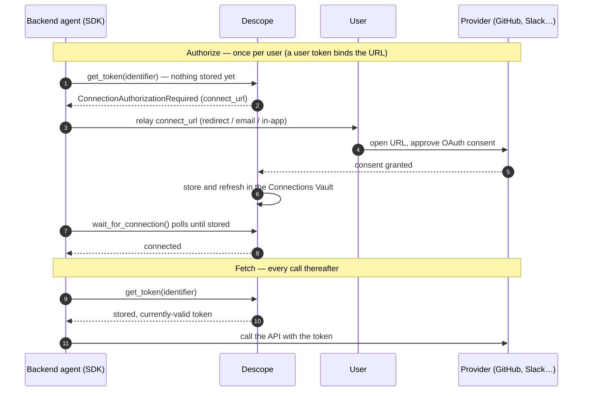

# Standalone Connections quickstart

Use `descope-agent-auth` on its own: your agent acquires a Descope credential and
exchanges it for downstream provider tokens (GitHub, Slack, Google, ...) from the
Descope vault.

> Building an MCP server? Use this SDK inside your tool handlers to fetch downstream
> tokens. (To *protect* the MCP server itself, use Descope's
> [MCP server SDKs](https://docs.descope.com/mcp) — this SDK is the client side.)

## The two phases

1. **Acquire** a Descope credential (configured once at init).
2. **Exchange** it for a Connection token (called repeatedly at runtime).

Refresh of both the Descope credential and the downstream tokens happens
transparently underneath — you ask for a token and get a currently-valid one.

## Authorize once, fetch every time

A Connection has **two separate operations** — keep them distinct:

1. **Authorize a user (once per user per connection).** The user grants your agent
   access: you send them a connect URL, they complete the provider's OAuth consent,
   and **Descope stores their tokens in the Connections Vault and keeps them
   refreshed**. You never handle the OAuth callback or store tokens yourself.
2. **Fetch the token (every time the agent acts).** `get_token` returns the
   **stored, currently-valid** token from the vault — no user, no browser, no refresh
   handling.



You get the connect URL for the authorize step two ways:

- **Proactively** — call `get_connect_url` / `getConnectUrl` (e.g. behind a "Connect
  GitHub" button), hand the user the URL.
- **Just in time** — `get_token` raises `ConnectionAuthorizationRequired` carrying the
  URL when the agent tries to act and the user isn't connected.

Either way, once the user consents the next `get_token` just works.
`wait_for_connection` is an optional helper that polls until the vault has the token.
**Who can authorize, and from where**, is covered in
[How a user connects when the agent is a backend process](#how-a-user-connects-when-the-agent-is-a-backend-process).

## Prerequisites

- A Descope project, and an **Outbound App / Connection** configured for the
  provider you want (e.g. `github`), set up at design time in the Descope Console
  or via the Descope MCP server. Default scopes live on the Connection.
- A way for the agent to authenticate to Descope (see provider table below).

---

## Python

```bash
pip install descope-agent-auth
```

```python
from descope_agent_auth import AgentAuthClient, AccessTokenProvider
from descope_agent_auth.errors import ConnectionAuthorizationRequired

# A *user-level* Connection token is fetched with that user's Descope access token
# (or a management key). A client-credentials / M2M agent token cannot read user
# tokens -- it can only fetch tenant-level Connection tokens or mint M2M-scoped
# Resource tokens. See "Picking a phase-1 provider" below.
client = AgentAuthClient(
    project_id="P2abc...",
    base_url="https://api.descope.com",
    credential=AccessTokenProvider(access_token=user_jwt),   # the user's Descope token
)

try:
    github = client.connections.get_token(
        connection="github",
        identifier="user@example.com",   # the user whose token you're fetching
        # scopes=["repo"],               # optional; overrides the Connection defaults
    )
    # github.access_token is a downstream GitHub token, refreshed as needed.
    use_github(github.access_token)
except ConnectionAuthorizationRequired as e:
    # The user hasn't connected GitHub yet. Send them to e.connect_url to consent,
    # then retry the exchange.
    redirect_user_to(e.connect_url)
```

### Three-line tool ergonomic

```python
from descope_agent_auth import with_connection

@with_connection(client, connection="github", scopes=["repo"])
def list_repos(token, identifier):
    gh = GitHub(auth=token)            # token injected, already scoped + fresh
    return [r.name for r in gh.repos.list_for_authenticated_user()]

repos = list_repos(identifier="user@example.com")
# ConnectionAuthorizationRequired propagates if the user must connect first.
```

### Async (Python)

The core is async; `AgentAuthClient` is a synchronous facade over it. In an async
app (FastAPI, LangGraph, …) use `AsyncAgentAuthClient` directly — same arguments and
methods, just awaited:

```python
from descope_agent_auth import AsyncAgentAuthClient, AccessTokenProvider

async with AsyncAgentAuthClient(
    project_id="P2...",
    credential=AccessTokenProvider(access_token=user_jwt),
) as client:
    github = await client.connections.get_token(connection="github", identifier=user_id)
    # await client.connections.get_tenant_token(...), wait_for_connection(...), etc.
```

`with_connection_async` is the awaitable counterpart of `with_connection`. The sync
`AgentAuthClient` keeps working unchanged.

---

## TypeScript

```bash
npm install @descope/agent-auth
```

```ts
import {
  AgentAuthClient,
  AccessTokenProvider,
  ConnectionAuthorizationRequired,
} from '@descope/agent-auth';

// A *user-level* Connection token is fetched with that user's Descope access token
// (or a management key). A client-credentials / M2M agent token cannot read user
// tokens -- it can only fetch tenant-level Connection tokens or mint M2M-scoped
// Resource tokens. See "Picking a phase-1 provider" below.
const client = new AgentAuthClient({
  projectId: 'P2abc...',
  baseUrl: 'https://api.descope.com',
  credential: new AccessTokenProvider({ accessToken: userJwt }), // the user's Descope token
});

try {
  const github = await client.connections.getToken({
    connection: 'github',
    identifier: 'user@example.com',
    // scopes: ['repo'],   // optional; overrides the Connection defaults
  });
  useGithub(github.accessToken);
} catch (e) {
  if (e instanceof ConnectionAuthorizationRequired) {
    redirectUserTo(e.connectUrl);
  } else {
    throw e;
  }
}
```

### Three-line tool ergonomic

```ts
import { withConnection } from '@descope/agent-auth';

const listRepos = withConnection(
  client,
  { connection: 'github', scopes: ['repo'] },
  async (token, identifier) => {
    const octokit = new Octokit({ auth: token });
    const { data } = await octokit.rest.repos.listForAuthenticatedUser();
    return data.map((r) => r.name);
  },
);

const repos = await listRepos('user@example.com');
```

---

## Picking a phase-1 provider

| Provider | Use when |
| --- | --- |
| `ClientCredentialsProvider` | autonomous agent, no user in the loop |
| `DeviceCodeProvider` | headless agent (no browser); shows a verification URL + code |
| `CibaProvider` | the agent needs a specific user's approval out of band |
| `AccessTokenProvider` | you already hold a user's Descope access token (user-scoped access) |
| `JwtBearerProvider` | you hold a signed JWT from a Descope-registered trusted issuer (RFC 7523 — e.g. a cloud workload-identity token) |
| `ManagementKeyProvider` | privileged, **not recommended** — bypasses Policies |

> **What a credential can fetch differs.** Phase-1 auth and phase-2 fetch authority
> are not the same thing. A **user-level Connection token** (the common case —
> `connections.get_token(identifier=user_id)`) can only be fetched with **that
> user's access token** (`AccessTokenProvider` / `act_as_user_token`) or a
> **management key**. A client-credentials / M2M token **cannot** read user-level
> tokens; it can fetch **tenant-level** Connection tokens (when the client is
> associated with that tenant — via `get_tenant_token` / `getTenantToken`) and mint
> **Resource** tokens, which are scoped to the M2M client itself, not a user.

### User-scoped access

To act as a specific user — and to mint **user-scoped Resource tokens** — present
that user's Descope access token (from your app's login, device-code, or CIBA).
Either configure the client with `AccessTokenProvider`, or pass
`act_as_user_token` / `actAsUserToken` per call on a shared client:

```python
from descope_agent_auth import AccessTokenProvider

# Option A — a client bound to the user's token:
client = AgentAuthClient(project_id="P2...", credential=AccessTokenProvider(access_token=user_jwt))
gh = client.connections.get_token(connection="github", identifier=user_id)

# Option B — one shared client, user token per call:
gh = client.connections.get_token(connection="github", identifier=user_id, act_as_user_token=user_jwt)
res = client.resources.get_token(resource="urn:my-api", act_as_user_token=user_jwt)
```

```ts
import { AccessTokenProvider } from '@descope/agent-auth';

const client = new AgentAuthClient({ projectId: 'P2...', credential: new AccessTokenProvider({ accessToken: userJwt }) });
await client.connections.getToken({ connection: 'github', identifier: userId });

// or per call on a shared client:
await client.connections.getToken({ connection: 'github', identifier: userId, actAsUserToken: userJwt });
```

### Management key (trusted backend, no user token)

A common backend shape: an agent runs server-side with **no user token on hand** and
needs to read a specific user's already-connected token. A management key fetches
**any** user's Connection token by `identifier` (and `tenant_id` for a tenant-bound
one). It **bypasses Policies**, so treat this path as privileged and guard who can
invoke it — it isn't the recommended default, but it's operationally simple for a
trusted backend.

```python
from descope_agent_auth import AgentAuthClient, ManagementKeyProvider

client = AgentAuthClient(
    project_id="P2...",
    credential=ManagementKeyProvider(management_key="K...", allow_management_key=True),
)

# Any user's token by id:
gh = client.connections.get_token(connection="github", identifier=user_id)

# A user's tenant-bound token (multi-tenant Connections):
gh = client.connections.get_token(connection="github", identifier=user_id, tenant_id="acme")

# Org-shared, no user:
slack = client.connections.get_tenant_token(connection="slack", tenant_id="acme")
```

```ts
import { AgentAuthClient, ManagementKeyProvider } from '@descope/agent-auth';

const client = new AgentAuthClient({
  projectId: 'P2...',
  credential: new ManagementKeyProvider({ managementKey: 'K...', allowManagementKey: true }),
});

await client.connections.getToken({ connection: 'github', identifier: userId });
await client.connections.getToken({ connection: 'github', identifier: userId, tenantId: 'acme' });
await client.connections.getTenantToken({ connection: 'slack', tenantId: 'acme' });
```

> A management key **reads** tokens; it can't perform a user's **initial** OAuth
> consent. The user must connect first through their own session (front-end
> `/connect`, the Outbound Apps widget, or a flow action) — see
> [How a user connects when the agent is a backend process](#how-a-user-connects-when-the-agent-is-a-backend-process).

## Scopes

- **Omit** `scopes` → the Connection's configured default scopes are used.
- **Pass** `scopes` → they fully override the defaults (not clamped to a subset).

The real guardrail on what an agent can obtain is **Policies** plus
downstream provider consent — not the default-scope list. The SDK never infers
scopes from agent intent; a request either omits them or pins an explicit set.

### Scopes and the connect URL

You define a tool's scopes in one place — `with_connection(scopes=[...])` /
`get_token(scopes=[...])` — and the SDK uses that same set for **both** the token
fetch **and** the connect URL it returns when the user hasn't connected yet. So the
consent screen requests exactly what that tool needs; a different tool with
different scopes produces a connect URL for those scopes. Omit `scopes` and the
connect URL uses the Connection's **default scopes** configured in Descope.

```python
@with_connection(client, connection="github", scopes=["repo"])
def list_repos(token, identifier): ...
# If the user must connect first, e.connect_url already requests ["repo"].
```

Because the connect URL requests only the calling tool's scopes, a user may be
prompted to connect more than once as different tools need new scopes (incremental
consent). To get a single up-front consent, set the Connection's **default scopes**
to the superset (and call tools without `scopes`), or request the superset.

Pass `redirect_url` / `redirectUrl` to control where the user lands after consenting.
(`connect_options` / `connectOptions` is an advanced escape hatch for extra
provider-specific OAuth params like `prompt` — most apps never need it.)

## Token levels: user, user + tenant, and tenant

A Connection's tokens live at one of three levels. Which one you fetch — and who is
allowed to fetch it — differ:

| Level | Fetch with | Who can fetch |
| --- | --- | --- |
| **User** | `get_token(identifier=user_id)` | the user's access token, or a management key |
| **User + tenant** | `get_token(identifier=user_id, tenant_id=…)` | the user's access token, or a management key |
| **Tenant** (org-shared, no user) | `get_tenant_token(tenant_id=…)` | an M2M client associated with the tenant, or a management key |

**User vs. user + tenant.** One Connection can hold *several* tokens for the same
user — one per tenant — and they are **not interchangeable**. Omit `tenant_id` to get
the user's tenant-less token; pass it to get the tenant-bound one. Asking for a
tenant-bound token *without* its `tenant_id` reads as "not connected" and raises
`ConnectionAuthorizationRequired`.

**Tenant-level** is the one Connection fetch an **autonomous agent** (client
credentials, no user token) can perform — the token belongs to the tenant, not a
user. It's admin/IaC-provisioned, so there's no connect-URL fallback on a miss.

```python
# User-level (the common case) — needs the user's token or a management key:
gh = client.connections.get_token(connection="github", identifier=user_id)

# Same user, a specific tenant's token for the same Connection:
gh_acme = client.connections.get_token(connection="github", identifier=user_id, tenant_id="acme")

# Tenant-level (org-shared, no user) — an M2M agent associated with the tenant can fetch it:
slack = client.connections.get_tenant_token(connection="slack", tenant_id="acme")
```

```ts
await client.connections.getToken({ connection: 'github', identifier: userId });
await client.connections.getToken({ connection: 'github', identifier: userId, tenantId: 'acme' });
await client.connections.getTenantToken({ connection: 'slack', tenantId: 'acme' });
```

## How a user connects when the agent is a backend process

The front-end path is simple: the user is present in a browser with a live Descope
session, your app calls `get_token`, catches `ConnectionAuthorizationRequired`, and
redirects them to `connect_url`. They consent, the token lands in the vault under
their identity, the retry succeeds.

End to end, authorize (once) then fetch (every call) looks like this:



A **backend job has neither a browser nor (usually) the user's live session token**,
so that path doesn't translate directly. A connect URL is always tied to a specific
user, so a **bare management key plus an identifier can't authorize one** — you need
the user present, or a token you can act as on their behalf. And more fundamentally:

> **A first-time third-party consent (GitHub, Slack, …) requires the user in a
> browser at the connect URL — there's no token-only shortcut.** This *is* the
> initial token-storage step: the consent is the thing being created, so there's no
> stored provider token to fall back on. **CIBA does not solve it**: CIBA
> authenticates the *user to Descope* and yields a Descope token, which is not a
> GitHub token — the user still has to consent to GitHub interactively.

So a backend-initiated connection is about getting the user to the connect URL (or
folding it into login). Three practical options:

1. **Defer to the user's next interactive moment (the common path).** When
   `get_token` raises `ConnectionAuthorizationRequired`, flag that this identity needs
   to connect and surface it the next time the user is in your front-end, where their
   **live session** builds the connect URL. Two ready-made ways to present it:
   - **Descope's hosted Outbound Apps widget** — a drop-in UI where users connect and
     manage their service connections (least code).
   - **Your own front-end** — a `/connect` route that redirects the user to the
     connect URL, e.g. on catching `ConnectionAuthorizationRequired`.

2. **Mint the URL from the backend and relay it.** The backend generates a
   user-bound connect URL, hands it to the user (print, email, in-app, redirect),
   and polls until they finish. It needs a **user token** — a stored refresh token
   from a prior login, or one obtained via **CIBA / device-code** — passed as
   `act_as_user_token`. (CIBA's role is exactly this: it gets you the *user token*;
   the user still consents to the provider in a browser.) A bare **management key
   can't** do this — you need a user token.

   ```python
   url = client.connections.get_connect_url(
       connection="github", identifier=user_id, act_as_user_token=user_token,
   )
   send_to_user(url)                          # print / email / in-app
   token = client.connections.wait_for_connection(
       connection="github", identifier=user_id, act_as_user_token=user_token,
   )                                          # polls until the user consents
   ```

3. **Connect *inside* the login flow (unique to Descope).** Because Descope login is
   flow-based, you can add a **connection step as a flow action** — so when the user
   authenticates (including via a CIBA flow), they consent to GitHub / HubSpot in that
   same flow, with no separate connect URL afterward. Not the common path, but an
   option a token-vault-only design can't offer.

In every case the provider consent itself is interactive (the user opens the URL or
completes the flow); the backend's job is to get the right URL in front of them and
then detect completion by polling with `wait_for_connection`.

### Waiting for the connection to complete

Once you've sent the user to the connect URL, `wait_for_connection` /
`waitForConnection` polls until they finish consenting (or a timeout), so you don't
hand-roll the retry loop. It uses whatever credential the client is configured with —
the same as `get_token` — so on a user-scoped client you pass nothing extra; on a
shared client, add `act_as_user_token` to act as that user.

```python
token = client.connections.wait_for_connection(
    connection="github",
    identifier=user_id,
    poll_interval=2.0,
    timeout=300.0,
)
# Returns once the user consents and the vault holds the token; AgentAuthError on timeout.
```

```ts
const token = await client.connections.waitForConnection({
  connection: 'github',
  identifier: userId,
  pollIntervalSeconds: 2,
  timeoutSeconds: 300,
});
```

## Common deployment patterns

Which calls you use depends on **whose account the agent acts against.**

### Per-user connections (each user connects their own account)

The default. Each user authorizes their own GitHub / Gmail / … once (interactive —
see [above](#how-a-user-connects-when-the-agent-is-a-backend-process)); thereafter
the agent fetches that user's token by `identifier`:

```python
gh = client.connections.get_token(connection="github", identifier=user_id)
```

### Org-managed (shared) credentials

One connection that **every user calls against** — a single org Gmail, Salesforce, or
GitHub — without each user authenticating separately. Store it as a **tenant-level**
connection and fetch it with `get_tenant_token`. An autonomous agent (client
credentials associated with the tenant) or a management key can read it:

```python
# client credentials (tenant-associated) — or ManagementKeyProvider
client = AgentAuthClient(
    project_id="P2...",
    credential=ClientCredentialsProvider(client_id="...", client_secret="..."),
)
gmail = client.connections.get_tenant_token(connection="gmail", tenant_id="acme")
```

### Background agent acting for many users

A single service account that runs work for many `userID`s. Use a **management key**
(it reads any user's token by `identifier`) and fetch per user:

```python
client = AgentAuthClient(
    project_id="P2...",
    credential=ManagementKeyProvider(management_key="K...", allow_management_key=True),
)
for user_id in batch:
    gh = client.connections.get_token(connection="github", identifier=user_id)
    ...
```

The catch: a management key **reads** tokens but can't mint a user's *initial* connect
URL (that needs the user's own session). So host a connect UI — Descope's **Outbound
Apps widget** or your own `/connect` page — where each user links their account once;
after that the background agent just fetches.

### Pre-authenticating users (custom UI / pre-flight)

To connect users **outside** an agent run — onboarding, a settings page, or a
pre-flight check before a task — generate the URL with `get_connect_url`, send the
user through, and wait:

```python
url = client.connections.get_connect_url(connection="gmail", identifier=user_id)
send_to_user(url)                       # redirect, button, or email
client.connections.wait_for_connection(connection="gmail", identifier=user_id)
```

To verify several required connections up front, loop and collect the ones still
needing a link:

```python
needs_connect = []
for conn in ["gmail", "github"]:
    try:
        client.connections.get_token(connection=conn, identifier=user_id)
    except ConnectionAuthorizationRequired as e:
        needs_connect.append((conn, e.connect_url))
# send each connect URL to the user, then proceed once needs_connect is empty
```

## Human-in-the-loop approval (CIBA gate)

For a sensitive exchange, require a fresh user sign-off on a trusted device before
the token is handed back. Configure an `approval` provider on the client, then pass
`require_approval` / `requireApproval` to the exchange.

```python
from descope_agent_auth import AgentAuthClient, CibaProvider, ApprovalRequest

client = AgentAuthClient(
    project_id="P2abc...",
    credential=ClientCredentialsProvider(client_id="...", client_secret="..."),
    approval=CibaProvider(client_id="...", login_hint="user@example.com"),
)

token = client.connections.get_token(
    connection="github",
    identifier="user@example.com",
    require_approval=ApprovalRequest(
        login_hint="user@example.com",
        binding_message="Approve the agent deleting branch protection",
    ),
)
# Blocks until the user approves on their device, else raises ApprovalDenied / ApprovalTimeout.
```

```ts
const client = new AgentAuthClient({
  projectId: 'P2abc...',
  credential: new ClientCredentialsProvider({ clientId: '...', clientSecret: '...' }),
  approval: new CibaProvider({ clientId: '...', loginHint: 'user@example.com' }),
});

const token = await client.connections.getToken({
  connection: 'github',
  identifier: 'user@example.com',
  requireApproval: {
    loginHint: 'user@example.com',
    bindingMessage: 'Approve the agent deleting branch protection',
  },
});
```

## Errors worth catching

| Error | Meaning |
| --- | --- |
| `ConnectionAuthorizationRequired` | user hasn't connected the account; carries `connect_url` / `connectUrl` |
| `PolicyDenied` | agent token lacks Policy permission |
| `ApprovalDenied` / `ApprovalTimeout` | the CIBA gate was rejected or timed out |
| `CredentialAcquisitionFailed` | phase 1 failed (bad client creds, device-flow timeout, ...) |
| `TokenExchangeFailed` | other phase-2 transport/validation failure |

## Token storage & refresh

The `store` holds **both** phases: the phase-1 Descope credential (including its
**refresh token**, kept beyond the access token's expiry) and the phase-2
downstream tokens. Everything is refreshed lazily on access — you ask for a token
and get a currently-valid one.

This matters most for **device code / CIBA**: their tokens are persisted with the
refresh token, so a restarted or multi-process agent **refreshes instead of
re-running the interactive flow** (no second device prompt or CIBA push). `ClientCredentials` is simply re-acquired (no user
interaction); `ManagementKey` and bring-your-own `AccessTokenProvider` tokens are
not persisted.

By default everything is cached in-process (`MemoryTokenStore`) — fine for a single
long-running process, but lost on restart. For multi-process, serverless, or
restart-safe deployments, implement the `TokenStore` interface
(`get`/`set`/`delete`/`list`) over Redis, a database, or a secrets manager and pass
it as `store`.

> **Security:** with a persistent store, the credentials there now include
> **refresh tokens**. Treat the store as a secret store (encryption at rest, access
> controls). The SDK never logs token values.

### Caching vs. policy enforcement

Descope enforces **Policies at retrieval time** — i.e. when the SDK actually calls
the vault. A cached Connection/Resource token therefore **skips the policy check**
until it expires: if a Policy is tightened or access revoked, a cached token keeps
working until its TTL lapses.

If you need Policies (or revocation) re-evaluated on **every** call, turn off token
caching with `cache_tokens=False` / `cacheTokens: false` so each `get_token` hits
Descope:

```python
client = AgentAuthClient(
    project_id="P2...",
    credential=ClientCredentialsProvider(client_id="...", client_secret="..."),
    cache_tokens=False,   # every fetch re-enforces Policies (no token caching)
)
```

```ts
const client = new AgentAuthClient({
  projectId: 'P2...',
  credential: new ClientCredentialsProvider({ clientId: '...', clientSecret: '...' }),
  cacheTokens: false, // every fetch re-enforces Policies (no token caching)
});
```

This only stops caching the fetched Connection/Resource tokens — your agent's own
login isn't re-run on each call (device-code / CIBA sessions still persist and
refresh). For a one-off fresh fetch instead, pass `force_refresh=True` /
`forceRefresh: true` on the call.
